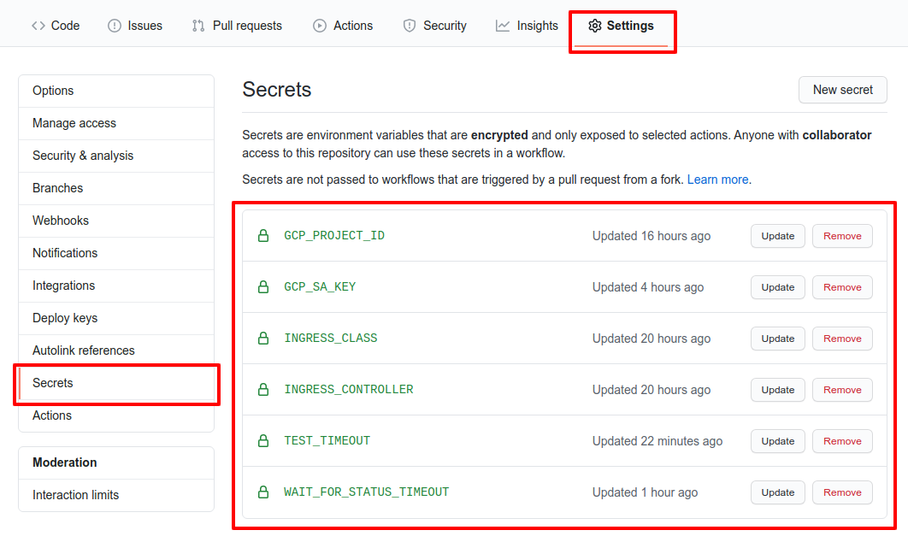

Sample repository to show how to run the conformance suite and generate reports using github pages.

### Website - https://<username>.github.io/<repository>/

### Github action jobs:

- *Setup gcloud* access
- *Create a Kubernetes cluster* using `https://get.k8s.io` and kube-up.sh
- *Prepare environment* downloads [sonobuoy](https://github.com/vmware-tanzu/sonobuoy) binary
- *Run conformance tests* using `sonobuoy run` and waits until finishes
- *Generate reports* extracts cucumber json files from `sonobuoy retrieve` output and generates static html files

### How I run the conformance test using a particular ingress controller?

- Fork the repository -> **Click Settings** -> **Click Secrets**
- Change secret `KUBE_CONFIG` value

where:

- **INGRESS_CLASS:** name of the class that are valid for the ingress controller
- **KUBE_CONFIG:** holds a kubeconfig file content
- **INGRESS_CONTROLLER:** name of the ingress controller (default `N/A`)
- **CONTROLLER_VERSION:** version of the ingress controller (default `N/A`)
- **GCP_PROJECT_ID:** ID of the [GCP Project](https://cloud.google.com/resource-manager/docs/creating-managing-projects) where the Kubernetes cluster will be created
- **GCP_SA_KEY:** [GCP Service account](https://cloud.google.com/iam/docs/service-accounts) with permissions to bootstrap a Kubernetes cluster
- **TEST_TIMEOUT:** adjust timeout to 2h (default is 20m)
- **WAIT_FOR_STATUS_TIMEOUT:**  adjust timeout to wait for Ingress status value to 10m (default is 5m)
- **INGRESS_CONFORMANCE_IMAGE:** ingress-controller-conformance container image

values:

- **INGRESS_CONFORMANCE_IMAGE:** `gcr.io/k8s-staging-ingressconformance/ingress-controller-conformance@sha256:33ad42ede4ae8b2f2f205da855bf0af12f78ec1860ca5713af5b82867235c502`