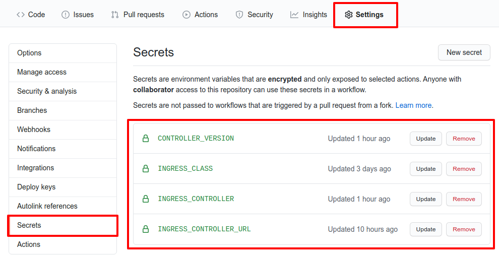

Sample repository to show how to run the conformance suite and generate reports using github pages.

### Website - https://<username>.github.io/<repository>/

### Github action jobs:

- *Prepare environment* downloads [sonobuoy](https://github.com/vmware-tanzu/sonobuoy) binary
- *Create Kubernetes cluster* using [kind](https://kind.sigs.k8s.io/)
- *Prepare cluster for testing* installs an ingress controller
- *Run conformance tests* using `sonobuoy run` and waits until finishes
- *Generate reports* extracts cucumber json files from `sonobuoy retrieve` output and generates static html files

### How I run the conformance test using a particular ingress controller?

- Fork the repository -> **Click Settings** -> **Click Secrets**
- Change secrets `INGRESS_CLASS` and `INGRESS_CONTROLLER_URL` values

where:

- **INGRESS_CLASS:** name of the class that are valid for the ingress controller
- **INGRESS_CONTROLLER_URL:** URL to install the ingress controller using `kubectl apply -f <URL>`
- **INGRESS_CONTROLLER:** name of the ingress controller (default `N/A`)
- **CONTROLLER_VERSION:** version of the ingress controller (default `N/A`)
- **INGRESS_CONFORMANCE_IMAGE:** ingress-controller-conformance container image
- **TEST_TIMEOUT:** adjust timeout to 2h (default is 20m)
- **WAIT_FOR_STATUS_TIMEOUT:**  adjust timeout to wait for Ingress status value to 10m (default is 5m)
- **INGRESS_CONFORMANCE_IMAGE:** ingress-controller-conformance container image

values:

- **INGRESS_CONFORMANCE_IMAGE:** `gcr.io/k8s-staging-ingressconformance/ingress-controller-conformance@sha256:148a649b7d009e8544e2631950b0c05a41cf9a50ede39e20b76bdaaf2ffb873b`
